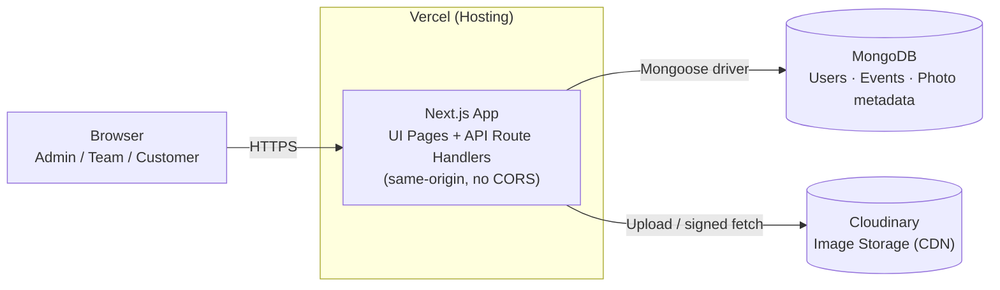
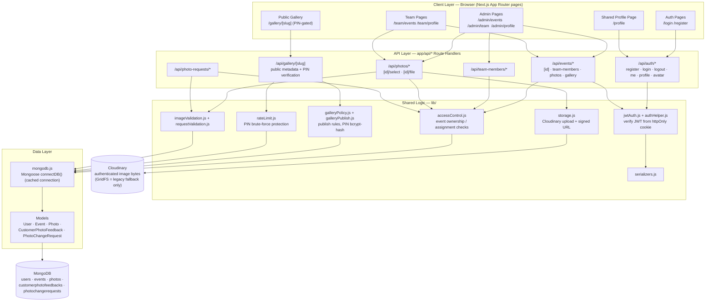

# Trizen Photo Ops — Architecture

One Next.js app serves both the UI (App Router pages) and the API
(`app/api/*` route handlers), backed by MongoDB via Mongoose, with all
image bytes stored in Cloudinary. Same-origin by design, so there's no
CORS to configure. Deployed on Vercel.

> Both diagrams below are plain Mermaid — GitHub, GitLab, Azure DevOps,
> Notion, and most doc tools render ```mermaid fences natively. For
> anything else, paste the block into https://mermaid.live and export
> as PNG/SVG.

---

## 1. Basic Architecture

High-level view: who talks to what.



**Read:** the browser talks only to the Next.js app (both pages and API
live there). The app is the only thing that talks to MongoDB (metadata:
users, events, photo records) and to Cloudinary (the actual image
bytes). Nothing else in the system has direct access to either store.

---

## 2. Detailed Architecture

Full request path, from page to route handler to shared logic to
storage.



**Read, layer by layer:**

- **Client layer** — five page groups sharing one design-token set
  (shadcn/ui primitives ported to plain JS, no TypeScript). Admin, team,
  and public-gallery surfaces reuse the same components rather than
  branching into separate UIs.
- **API layer** — one route-handler group per domain. Every event-scoped
  route re-checks ownership/assignment server-side, not just in the UI.
- **Shared logic (`lib/`)** — the policy layer routes funnel through:
  JWT verification, access control, rate limiting on the gallery PIN,
  publish rules, and file validation, before anything touches storage.
- **Data layer** — a single cached Mongoose connection
  (`mongodb.js`) feeding five models. Image *bytes* never enter MongoDB;
  only Cloudinary identifiers and metadata do.
- **External storage** — MongoDB holds structured data, Cloudinary holds
  image bytes as authenticated assets served through signed URLs, never
  exposed directly in page markup.

---

## 3. Technology Stack

| Layer | Technology | Notes |
|---|---|---|
| Frontend framework | Next.js 16 (App Router), React 19 | Pages + API routes in one app |
| Styling / UI kit | Tailwind CSS 4, shadcn/ui (ported to JS), Radix UI primitives | One shared token set across admin/team/customer surfaces |
| Forms | react-hook-form | |
| Icons / media | lucide-react, yet-another-react-lightbox | |
| HTTP client | axios (`lib/api.js`) | Frontend → same-origin API |
| Backend | Next.js Route Handlers (`app/api/*`) | No separate server; same-origin, no CORS |
| Database | MongoDB, Mongoose 9 (ODM) | Cached connection per serverless instance |
| Auth | JWT (`jsonwebtoken`) in httpOnly cookie, `bcryptjs` for password/PIN hashing | Custom-built, no third-party auth provider |
| Image storage | Cloudinary (authenticated assets) | GridFS retained only as a migration fallback |
| Language | JavaScript (no TypeScript) | Explicit project choice |
| Testing | Node built-in test runner (`node --test`) | Covers authZ, PIN policy, rate limiter |
| Hosting | Vercel | Serverless functions |

---

## 4. Integrations

- **MongoDB** (via Mongoose) — stores users, events, photo metadata,
  customer feedback, and photo change requests. Connection is cached
  across warm serverless invocations (`lib/mongodb.js`).
- **Cloudinary** — stores all image bytes as authenticated assets.
  Credentials are server-only; delivery goes through a signed URL
  generated on request (`GET /api/photos/[id]/file`), never embedded
  directly in markup. A one-time migration script
  (`scripts/migrate-gridfs-to-cloudinary.cjs`) moves any legacy
  GridFS-stored images across.
- **JWT auth** — `jsonwebtoken` issues a token on login, stored in an
  httpOnly cookie; every protected route reads it via
  `getAuthUser()` (`lib/authHelper.js`). `JWT_SECRET` has no fallback —
  the app refuses to start without it.
- **Vercel** — hosts the Next.js app as serverless functions; env vars
  (`MONGODB_URL`, `JWT_SECRET`, `CLOUDINARY_*`) are set per environment
  (Production/Preview/Development).

---

## 5. Security notes worth keeping in the docs

- Passwords hashed with bcrypt; gallery PINs bcrypt-hashed at rest and
  only ever returned in plaintext once, at publish time.
- Every event-scoped route re-verifies ownership/assignment server-side.
- Gallery PIN verification is rate-limited per gallery + IP.
- Profile/avatar routes always act on the caller's own account — the
  target user comes from the auth cookie, never from a body or URL
  param.
